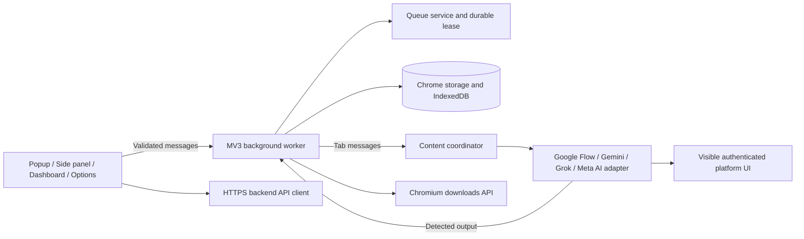

# LuffyFlow


LuffyFlow is a Chromium Manifest V3 extension for preparing prompt queues, submitting them sequentially on supported AI websites, and organizing detected outputs with deterministic filenames and download history.

The project currently supports adapters for:

- Google Flow
- Google Gemini
- Grok, including the explicit X `/i/grok` route
- Meta AI on its standalone `meta.ai` web experience

LuffyFlow is at version `0.1.0`. It has a passing production build and automated validation pipeline, but it is not yet approved for public release. See [Production readiness](#production-readiness) and the [production checklist](docs/production-checklist.md).

## What it does

- Accepts manually entered prompts or local `.txt`, `.csv`, and `.json` prompt files.
- Treats `.txt` as one prompt per non-empty line.
- Lets users review, edit, select, remove, and reorder prompts before queueing them.
- Runs one queue at a time with explicit start, pause, resume, retry, skip, and stop controls.
- Persists queue state and uses worker leases to reduce duplicate submissions after Manifest V3 service-worker suspension.
- Detects text and media outputs through platform-specific adapters.
- Prevents duplicate output records with stable fingerprints.
- Generates safe sequence-based filenames and validates user renames.
- Downloads text as TXT, Markdown, JSON, or CSV and bundles multiple text outputs into ZIP files.
- Provides a popup, side panel, dashboard tab, options page, account/token-wallet controls, and adapter diagnostics.
- Uses the LuffyFlow backend API for authentication, prepaid token billing, purchase history, and low-balance reminder settings.

LuffyFlow does not bypass authentication, CAPTCHAs, rate limits, paywalls, or platform access controls. It automates only visible user-interface elements in a page the user can already access.

## Current status

| Area                                      | Status                                                             |
| ----------------------------------------- | ------------------------------------------------------------------ |
| Strict TypeScript                         | Passing                                                            |
| ESLint and Prettier                       | Passing                                                            |
| Automated tests                           | Run `pnpm test` for the current result                             |
| Production browser smoke tests            | 3 passing Playwright tests in isolated Chrome for Testing          |
| Deterministic-core coverage               | 93.44% statements, 85.52% branches, 95.23% functions, 93.69% lines |
| Chrome MV3 production build               | Passing                                                            |
| Live authenticated adapter verification   | Pending                                                            |
| Least-privilege generated manifest review | Passing; no generated `<all_urls>` content scripts                 |
| Production backend and billing            | Implemented and connected; deployment configuration remains        |
| Chrome Web Store readiness                | Pending                                                            |

The generated manifest contains one narrowly matched platform content script. Shared coordinator modules live outside Plasmo's reserved `src/contents` entry directory so they are bundled as dependencies rather than registered independently.

## Requirements

- Node.js `20.19.0` or newer
- Corepack
- pnpm `10.34.5` through Corepack
- A Chromium-based browser with Manifest V3 support

The repository contains an exact pnpm lockfile. Do not replace it with npm or Yarn lockfiles.

## Installation

Install dependencies from the repository root:

```powershell
corepack pnpm install --frozen-lockfile
```

Create a local environment file if you need to override the safe development defaults:

```powershell
Copy-Item .env.example .env
```

Environment variables prefixed with `PLASMO_PUBLIC_` are embedded in extension bundles. Never place API secrets, signing keys, private billing credentials, or privileged backend tokens in them.

## Development

Start Plasmo's development build:

```powershell
corepack pnpm run dev
```

Load the generated development directory as an unpacked extension:

1. Open `chrome://extensions` or the equivalent browser extension page.
2. Enable Developer mode.
3. Choose **Load unpacked**.
4. Select `build/chrome-mv3-dev`.
5. Pin LuffyFlow if you want quick access to its popup.

Plasmo watches source changes and rebuilds the extension. Some background, content-script, manifest, and environment changes still require reloading the extension and affected platform tabs.

## Production build

Run the full release-grade validation pipeline:

```powershell
corepack pnpm run validate:release
```

This command performs:

1. Strict TypeScript checking.
2. Full-project ESLint.
3. The Vitest/JSDOM suite.
4. Prettier verification.
5. The enforced deterministic-core coverage gate.
6. A Chrome Manifest V3 production build.

The unpacked production build is written to `build/chrome-mv3-prod`.

To create Plasmo's distributable package after completing the production checklist:

```powershell
corepack pnpm run package
```

Do not publish a package solely because the automated command passes. Live platform verification, manifest review, privacy review, and store assets are separate release gates.

## Configuration

| Variable                       | Default                        | Purpose                                                  |
| ------------------------------ | ------------------------------ | -------------------------------------------------------- |
| `PLASMO_PUBLIC_API_BASE_URL`   | `http://localhost:8787/api/v1` | Fixed backend API URL; production values must use HTTPS. |
| `PLASMO_PUBLIC_APP_ENV`        | `development`                  | Selects development, test, or production validation.     |
| `PLASMO_PUBLIC_API_TIMEOUT_MS` | `15000`                        | Default bounded API request timeout.                     |

For a production backend build:

- Set `PLASMO_PUBLIC_APP_ENV=production`.
- Set `PLASMO_PUBLIC_API_BASE_URL` to the deployed HTTPS API URL, including `/api/v1`.
- Add the exact API origin to the production manifest permissions.
- Configure the backend's production database, secrets, payment webhooks, SMTP, CORS origin, and public base URL.
- Rebuild after environment changes; API configuration is compiled into the extension bundle.

## Using LuffyFlow

### 1. Sign in

Create an account against the configured backend and sign in with those credentials. No seeded development account is shipped.

### 2. Open a supported page

Navigate to an authenticated supported route:

- `https://flow.google/` or the Google Labs Flow route
- `https://gemini.google.com/` or `/app/...`
- `https://grok.com/`
- `https://x.com/i/grok`
- `https://meta.ai/`

Open LuffyFlow's popup and use the side panel or dashboard workspace. Unsupported pages remain read-only and cannot start a queue.

### 3. Add prompts

Enter prompts manually or upload a local file:

- TXT: one prompt per non-empty line; BOM and CRLF are supported.
- CSV: the `prompt` or `text` column is preferred, otherwise the first column is used.
- JSON: accepts supported arrays or an object containing `prompts`.

Files are parsed locally. Uploading a file never starts automation automatically. Review and explicitly add selected prompts to the queue.

Limits:

- Maximum import size: 2 MiB
- Maximum imported prompts: 1,000
- Maximum prompt length: 100,000 characters

### 4. Run the queue

Choose **Start** only after confirming the target tab and prompt order. LuffyFlow processes prompts serially and defaults to an eight-second inter-prompt delay.

- Pause interrupts uncertain in-flight work and requires explicit review/retry.
- Resume reacquires a durable queue lease.
- Stop cancels unfinished prompts and prevents new submissions.
- A service-worker restart never blindly replays an uncertain prompt; the queue enters recovery pause where necessary.

### 5. Review and download outputs

Captured outputs receive names using the default pattern:

```text
{platform}-{date}-{sequence}-{promptSlug}
```

Sequence allocation is persistent and defaults to global per-user scope. Filenames are normalized across Chromium, Windows, macOS, and Linux. Duplicate names receive a deterministic numeric suffix.

Text outputs can be exported as TXT, Markdown, JSON, or CSV. Multiple text records can be bundled into a ZIP. Media downloads require an accessible platform-provided HTTP(S) URL.

## Extension surfaces

- **Popup:** account summary, active-platform detection, and quick navigation.
- **Side panel:** in-context queue workspace on supported browsers.
- **Dashboard:** overview, prompt history, outputs, token purchases/reminders, settings, and account pages.
- **Options page:** authenticated settings surface.
- **In-page fallback:** closed Shadow DOM workspace for browsers without the side-panel API.

## Architecture



Important boundaries:

- Zod schemas validate persisted data, API responses, imports, settings, and runtime messages.
- UI components depend on injected services and Zustand stores rather than browser implementations directly.
- The background worker is the authority for queue transitions, usage authorization, output capture, and downloads.
- Content code owns DOM interaction and platform adapter lifecycles.
- Platform-specific selectors are isolated from shared queue and persistence logic.
- IndexedDB stores prompts and outputs; small versioned namespaces store settings, authenticated sessions, queue coordination, and sequence counters.

See [architecture.md](docs/architecture.md) for the detailed design and staged documents under `docs/` for implementation history.

## Permissions

| Permission  | Why LuffyFlow uses it                                           |
| ----------- | --------------------------------------------------------------- |
| `storage`   | Sessions, settings, durable queue state, and sequence counters. |
| `downloads` | User-requested output exports and media downloads.              |
| `tabs`      | Active-tab detection and background-to-content coordination.    |
| `sidePanel` | Preferred in-context workspace.                                 |
| `alarms`    | Worker-safe maintenance and recovery hints.                     |

Declared host permissions cover only the documented Google Flow, Gemini, Grok, Meta AI, and X hosts plus the local development API. Replace the local API permission with the deployed HTTPS origin for release. The generated manifest contains no `<all_urls>` content-script entries.

Incognito mode is disabled.

## Security and privacy

- Prompt files are read locally and are not uploaded by the import service.
- Passwords are transient form/API request values. The backend stores password hashes, never plaintext passwords.
- The backend stores refresh-token hashes; client bearer credentials remain in extension-local storage.
- Structured logs redact passwords, tokens, authorization headers, cookies, and prompt/output content when privacy mode is enabled.
- API requests use a validated fixed origin; non-local production traffic requires HTTPS.
- Downloads accept only validated local data URLs or accessible HTTP(S) media URLs.
- React renders output as text; the application does not inject platform HTML.
- Output filenames remove path separators, control characters, reserved device names, and unsafe trailing characters.
- Queue and record updates use revisions, leases, fingerprints, and idempotency keys to reduce conflicts and duplicate actions.
- The settings page can export local account/settings/prompt/output data and clear local data after confirmation.

Before production, publish a privacy policy that accurately describes host-page access, local storage, any backend transfer, retention, deletion, diagnostics, and third-party platform processing.

## Testing

Common commands:

```powershell
corepack pnpm run typecheck
corepack pnpm run lint
corepack pnpm test
corepack pnpm run test:coverage
corepack pnpm run test:browser:install
corepack pnpm run test:browser
corepack pnpm run format:check
corepack pnpm run build
corepack pnpm run validate:release
corepack pnpm run validate:stage10
```

The tests use isolated browser and API test doubles and cover authentication, TXT import, queue execution, output capture, persistent sequence naming, token billing, and download completion. Test doubles are not bundled into production code.

Coverage percentages apply to deterministic, platform-independent invariants: filename/output naming, queue-state transitions, and versioned storage. They do not claim live Chromium or live AI-platform end-to-end coverage.

The Playwright suite loads the production extension into an isolated Chrome for Testing profile and checks manifest assets, signed-out surfaces, and the absence of seeded credentials or obsolete storage. It does not reuse personal browser data or claim authenticated live-platform coverage. Follow [Stage 10 browser validation](docs/stage-10-browser-validation.md) for live adapter evidence.

## Data and recovery behavior

- Only one non-terminal queue can own the durable queue slot.
- Record updates require expected revisions.
- Output fingerprints prevent repeated detection events from saving the same output twice.
- Uncertain in-flight prompts are failed and paused after worker recovery instead of replayed automatically.
- Download record status is persisted, but the mapping from Chromium download ID to output ID is in memory and can be lost during worker suspension.
- Media source URLs may expire with the platform session.

## Troubleshooting

### Clicking the toolbar icon shows nothing

Run `corepack pnpm run build`, then open `chrome://extensions` and load or reload the exact `build/chrome-mv3-prod` directory. Do not load the repository root or `.plasmo`; development output also requires `corepack pnpm run dev` to remain running. If an older unpacked copy is installed, remove it before loading the production directory again. The generated manifest must show `popup.html` under `action.default_popup`.

### The active page is unsupported

Confirm the page uses HTTPS and matches an explicit supported route. Reload the platform tab after installing or reloading the extension. X routes other than `/i/grok` are intentionally rejected by the Grok adapter.

### The adapter says selectors are missing

Open Settings and review the adapter diagnostics. Platform DOM is undocumented and selectors are currently provisional. Selector overrides accept ordered CSS selector strings only; they cannot execute JavaScript. Do not add broad selectors that could target unrelated controls.

### The queue paused after a restart or navigation

Review the interrupted prompt and current platform state. Retry explicitly only when duplicate submission is safe. LuffyFlow intentionally favors pausing over replaying uncertain work.

### A download failed

For media, revisit the original platform page so its signed URL is current. Large text or ZIP exports use generated data URLs and may reach browser memory/URL limits. Retry from the output library after confirming storage and download permissions.

### Backend configuration does not take effect

Rebuild and reload the extension after changing `PLASMO_PUBLIC_API_BASE_URL`. A different origin also needs an exact manifest host permission.

### The production build fails during PostCSS loading

Keep the Parcel-compatible `.postcssrc.json` file. This Plasmo/Parcel toolchain must not be switched back to a CommonJS PostCSS file without verifying the bundler configuration parser.

## Known limitations

- Google Flow, Gemini, Grok, and Meta AI selectors have not been validated against authenticated live pages in this environment.
- Authentication and prepaid token billing require a reachable LuffyFlow backend. Payment completion and reminder mail also require correctly configured provider webhooks and SMTP.
- Prompt, output, and settings records remain local to the browser; multi-device sync is not currently claimed.
- Automatic save/download settings are persisted but are not yet a complete unattended output pipeline.
- Browser download-ID tracking is in memory and can be lost when the background worker is suspended.
- Large text and ZIP exports use data URLs rather than a streaming/offscreen-document pipeline.
- Backend URL changes require a compatible manifest permission and service-graph reload.
- No live-platform end-to-end tests are included.
- The project is private and `UNLICENSED`; a production license decision is still required.

## Production readiness

Automated build quality is green, but public release remains blocked by:

1. Validating every platform adapter on authenticated live pages.
2. Reviewing each platform's terms and obtaining any required permission for automation.
3. Deploying and security-reviewing the backend, authentication, token billing, reminders, and usage enforcement.
4. Publishing privacy, support, retention, and account-deletion policies.
5. Completing accessibility, upgrade/migration, worker-suspension, and cross-browser smoke tests.
6. Choosing a license and preparing signed store artifacts and listing assets.

Use [docs/production-checklist.md](docs/production-checklist.md) as the release sign-off record.

## Repository guide

```text
assets/                         Extension icon source
docs/                           Architecture, stage notes, and release checklist
src/adapters/                   Platform contracts, selectors, and DOM automation
src/api/                        Typed API clients and the HTTP transport
src/background/                 Queue orchestration and MV3 worker runtime
src/components/                 Reusable React UI
src/content-runtime/            Shared content coordination and message handlers
src/contents/                   Narrow Plasmo content-script entry
src/messaging/                  Validated extension message transport/router
src/schemas/                    Zod runtime schemas and inferred domain types
src/services/                   Auth, billing, queue, naming, output, and download logic
src/storage/                    Versioned Chrome storage and IndexedDB repositories
src/stores/                     Zustand UI state
tests/                          Unit, React, browser-mock, and integration-style tests
build/chrome-mv3-prod/          Generated production build
```

## License

`UNLICENSED`. No permission is granted to copy, redistribute, or publish this project until the owner selects and adds an explicit license.
