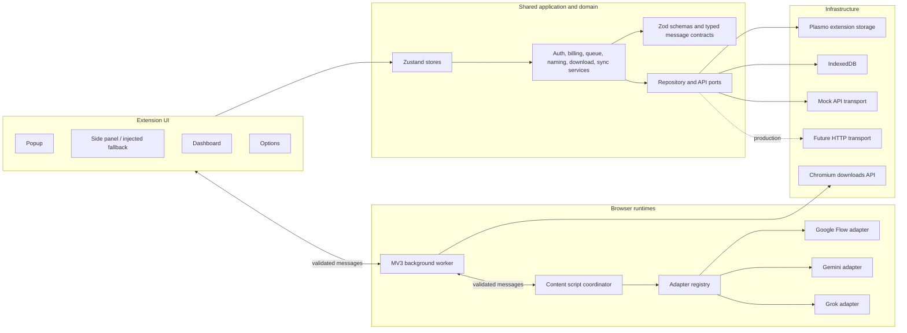
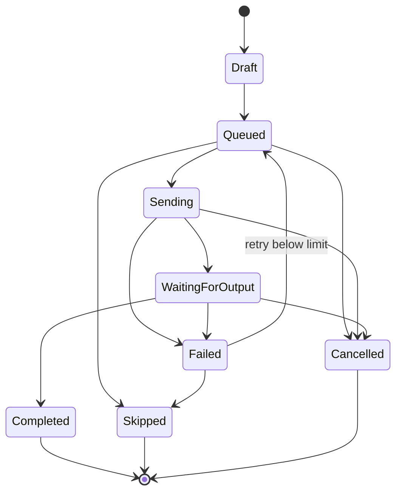
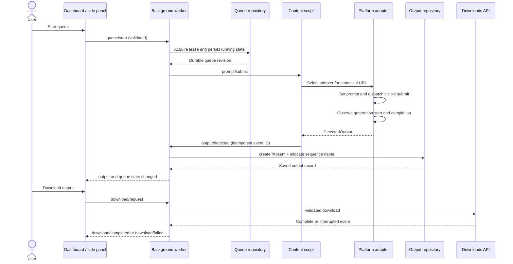

# LuffyFlow — Stage 1 Architecture

**Status:** Architecture approved for implementation  
**Primary target:** Chromium browsers (Chrome, Edge, and Brave), Manifest V3  
**Extension framework:** Plasmo, React, and strict TypeScript  
**Document date:** 2026-07-31

## 1. Scope and product boundaries

LuffyFlow is a browser extension that helps an authenticated user prepare a queue of prompts, submit those prompts through the visible interfaces of Google Flow, Google Gemini, and Grok, detect the resulting outputs, and organize or download the output records.

The extension automates only actions that an authenticated user can perform in the visible website UI. It will not bypass authentication, CAPTCHAs, rate limits, signed-URL restrictions, cross-origin protections, platform permissions, or anti-bot systems. Rate-limit or service-unavailable signals pause the queue and require the user to decide when it is safe to resume.

The first implementation uses mock authentication, billing, usage, and record APIs behind replaceable interfaces. Mock credentials and mock payment state are development conveniences, not production security or a real checkout system.

### 1.1 Stage boundary

This document is the complete Stage 1 deliverable. It defines architecture, contracts, permissions, risks, and the intended project tree. Configuration and executable source files begin in Stage 2 and later stages, so they are intentionally not created here.

### 1.2 Prompt input sources

All prompt sources enter one shared validation and normalization pipeline:

1. A single prompt typed in the editor.
2. Multiple prompts pasted into the editor and split by non-empty lines.
3. A UTF-8 `.txt` file, where each non-empty line is a prompt.
4. A `.csv` file with a `prompt` or `text` column, or the first column when a header is absent.
5. A `.json` file containing either an array of strings, an array of prompt objects, or an object with a `prompts` array.

`.txt` upload is a first-class workflow, not a fallback. The side panel and dashboard prompt composer both expose an accessible file picker and drag-and-drop target. Importing never starts automation automatically: the user can review, edit, reorder, or remove parsed prompts before adding them to the queue.

Files are parsed locally and are not uploaded to the mock or real backend merely by selecting them. The initial safe limit is 2 MiB per import and 1,000 prompts per batch; both limits will be named constants. Invalid rows produce actionable diagnostics without silently discarding valid rows. A UTF-8 byte-order mark is removed, CRLF and CR line endings are normalized, whitespace-only lines are ignored, and duplicate prompts are retained because repetition can be intentional.

## 2. Key technical decisions

### 2.1 Runtime separation

LuffyFlow has five runtime surfaces with deliberately narrow responsibilities:

| Runtime                        | Responsibilities                                                                                                                                                    | Durable authority                             |
| ------------------------------ | ------------------------------------------------------------------------------------------------------------------------------------------------------------------- | --------------------------------------------- |
| Background service worker      | Message validation and routing, queue lease coordination, download requests, badge updates, usage events, alarms, active-tab/platform detection, lifecycle recovery | Queue lease and persisted orchestration state |
| Content script                 | Platform adapter lifecycle, DOM observation, prompt insertion/submission, output detection, SPA navigation handling                                                 | Current page DOM only                         |
| Side panel / injected fallback | Prompt composition and file import, queue controls, live progress, recent outputs                                                                                   | Presentation state only                       |
| Popup                          | Compact account/platform/session summary and navigation                                                                                                             | Presentation state only                       |
| Dashboard / options            | History, output library, subscription, account, imports, settings, data export/clear actions                                                                        | Presentation state only                       |

No UI surface owns a long-running queue. UI controls send typed commands to the background worker, which persists intent before instructing a content script. This accounts for popup closure, side-panel closure, and Manifest V3 service-worker suspension.

### 2.2 Clean architecture boundaries

Dependencies point inward:

```text
React surfaces / Plasmo entry points
                │
                ▼
Application services and stores
                │
                ▼
Domain models, schemas, and ports
                ▲
                │
Infrastructure adapters
(Plasmo Storage, IndexedDB, Chrome APIs, mock/HTTP transports, page DOM)
```

Domain and application modules do not import browser globals, React, Plasmo entry points, or platform-specific selectors. Browser APIs, persistence engines, API transports, and page automation implement interfaces defined in the inner layers and are injected at composition roots.

### 2.3 Platform isolation

Every website has a separate adapter package containing:

- A selector configuration file with ordered semantic selectors and explicitly marked unverified fallbacks.
- Adapter behavior implementing the shared `PlatformAdapter` interface.
- Output extractors appropriate for text and media.
- Adapter-specific fixtures and contract tests.

Shared DOM utilities know how to observe, retry, dispatch framework-compatible events, detect stable DOM state, and handle cancellation. They do not know any Google Flow, Gemini, or Grok selectors.

### 2.4 Queue durability and single-run safety

The queue is a persisted state machine rather than a timer held in memory. Before dispatch, the background worker obtains a storage-backed queue lease containing an owner ID, generation number, and expiry. Compare-and-swap repository updates prevent two recovered workers or two UI surfaces from starting the same queue.

After each meaningful transition, queue state is persisted. On restart, the worker restores the queue conservatively:

- `queued` items remain eligible.
- `sending` or `waiting_for_output` items become `paused_recovery` at the queue level until the active tab is inspected.
- Already completed prompts are never submitted again.
- Output fingerprint and event IDs make repeated output reports idempotent.

The worker uses alarms only for maintenance and wake-up hints. It does not assume alarms or background memory provide exact scheduling.

### 2.5 State management

Zustand stores coordinate React UI state and application actions. Persisted entities remain in repositories; stores hydrate from repositories and subscribe to typed messages rather than becoming a second database.

React Hook Form manages forms. Zod schemas are the single runtime-validation boundary for forms, imported files, API payloads, stored records, environment-derived configuration, and extension messages. TypeScript types are inferred from schemas where practical.

### 2.6 Storage allocation

| Namespace                       | Default store                              | Rationale                                   |
| ------------------------------- | ------------------------------------------ | ------------------------------------------- |
| Authentication/session metadata | Extension local storage                    | Small and needed across extension runtimes  |
| User profile                    | Extension local storage                    | Small durable record                        |
| Subscription and usage cache    | Extension local storage                    | Small, replaceable server cache             |
| Settings and selector overrides | Extension local storage                    | Cross-runtime configuration                 |
| Queue state and queue lease     | Extension local storage                    | Must survive worker suspension              |
| Sequence counters               | Extension local storage                    | Atomic-ish, small, persistent counters      |
| Sessions and sync metadata      | Extension local storage                    | Small coordination records                  |
| Prompt and output metadata      | IndexedDB, with a repository facade        | Can grow beyond storage-local comfort       |
| Large binary output content     | Not stored in extension sync/local storage | Download by permitted URL or transient Blob |

All namespaces include a schema version. Migrations are forward-only, idempotent, and backed up before destructive shape changes. Plasmo Storage wraps extension storage; an IndexedDB adapter handles larger record collections. A mock remote repository and future HTTP repository implement the same record ports.

### 2.7 Output identity and conflict handling

An output has a stable UUID independent from its filename. A content script computes a non-sensitive fingerprint from adapter ID, prompt ID, output type, normalized source identity, and generation marker. The output repository enforces uniqueness on `(sessionId, fingerprint)`.

Records include `revision`, `updatedAt`, and `syncStatus`. Updates use optimistic concurrency:

- A rename must include the last observed revision.
- A conflict returns the current record instead of overwriting it.
- User-authored names take precedence over regenerated automatic names.
- Remote sync is outbox-based and idempotent.

### 2.8 Sequential naming

The naming service receives an atomic sequence allocation from `SequenceRepository`, renders configured tokens, sanitizes the basename, preserves or deliberately converts the extension, limits the filename length, and reserves a unique filename. Scope keys support global, platform, day, and session strategies.

Sequence allocation and output persistence are coordinated so counters never depend on a popup process. Gaps are acceptable after a crash; duplicate sequence allocations are not.

### 2.9 Download strategy

Download planning is separated from Chrome download execution:

- Text can be rendered as TXT, Markdown, JSON, or CSV.
- Multiple text outputs can be streamed into a ZIP created locally.
- Media uses an accessible platform-provided URL and declared MIME/extension.
- Metadata and history can be exported as JSON or CSV.

The background worker validates schemes, filename safety, and permissions before calling the downloads API. It records the browser download ID and maps download completion/interruption events back to output records. The extension does not attempt to refresh expired signed URLs or bypass CORS; the user is told to regenerate or revisit the platform when a URL is no longer valid.

### 2.10 Side-panel fallback

Chrome Side Panel is the preferred workspace. A build-time/runtime capability check enables an injected in-page panel when the API is unavailable. Both surfaces render the same feature components and call the same application services. The injected root uses a Shadow DOM boundary to reduce style conflicts and is removable without modifying host content.

## 3. Architecture overview



## 4. Intended project directory tree

The tree follows Plasmo entry-point conventions while keeping application code under `src`.

```text
luffyflow/
├─ .env.example
├─ .gitignore
├─ .prettierignore
├─ .prettierrc.json
├─ eslint.config.mjs
├─ package.json
├─ plasmo.config.ts
├─ .postcssrc.json
├─ tailwind.config.ts
├─ tsconfig.json
├─ vitest.config.ts
├─ README.md
├─ docs/
│  ├─ architecture.md
│  ├─ backend-contracts.md
│  ├─ permissions.md
│  ├─ selector-maintenance.md
│  └─ production-checklist.md
├─ assets/
│  └─ icons/
├─ src/
│  ├─ background/
│  │  ├─ index.ts
│  │  ├─ badge-controller.ts
│  │  ├─ lifecycle-controller.ts
│  │  ├─ message-router.ts
│  │  └─ queue-coordinator.ts
│  ├─ contents/
│  │  ├─ luffyflow.tsx
│  │  ├─ content-coordinator.ts
│  │  ├─ injected-panel-host.tsx
│  │  └─ spa-navigation-observer.ts
│  ├─ popup/
│  │  ├─ index.tsx
│  │  └─ PopupApp.tsx
│  ├─ sidepanel/
│  │  ├─ index.tsx
│  │  └─ SidePanelApp.tsx
│  ├─ options/
│  │  ├─ index.tsx
│  │  └─ OptionsApp.tsx
│  ├─ tabs/
│  │  ├─ dashboard.tsx
│  │  └─ DashboardApp.tsx
│  ├─ routes/
│  │  ├─ AppRouter.tsx
│  │  └─ ProtectedRoute.tsx
│  ├─ pages/
│  │  ├─ OverviewPage.tsx
│  │  ├─ PromptHistoryPage.tsx
│  │  ├─ OutputLibraryPage.tsx
│  │  ├─ SubscriptionPage.tsx
│  │  ├─ SettingsPage.tsx
│  │  └─ AccountPage.tsx
│  ├─ components/
│  │  ├─ common/
│  │  ├─ auth/
│  │  ├─ billing/
│  │  ├─ prompts/
│  │  │  ├─ PromptComposer.tsx
│  │  │  ├─ PromptFileImport.tsx
│  │  │  ├─ PromptImportPreview.tsx
│  │  │  └─ PromptQueueItem.tsx
│  │  ├─ outputs/
│  │  └─ settings/
│  ├─ adapters/
│  │  ├─ contracts.ts
│  │  ├─ registry.ts
│  │  ├─ shared/
│  │  │  ├─ dom-events.ts
│  │  │  ├─ dom-observer.ts
│  │  │  ├─ resilient-query.ts
│  │  │  ├─ retry.ts
│  │  │  └─ url-observer.ts
│  │  ├─ google-flow/
│  │  │  ├─ adapter.ts
│  │  │  ├─ output-extractor.ts
│  │  │  └─ selectors.ts
│  │  ├─ gemini/
│  │  │  ├─ adapter.ts
│  │  │  ├─ output-extractor.ts
│  │  │  └─ selectors.ts
│  │  └─ grok/
│  │     ├─ adapter.ts
│  │     ├─ output-extractor.ts
│  │     └─ selectors.ts
│  ├─ api/
│  │  ├─ client/
│  │  │  ├─ ApiClient.ts
│  │  │  └─ contracts.ts
│  │  ├─ mock/
│  │  │  ├─ MockTransport.ts
│  │  │  ├─ handlers.ts
│  │  │  └─ seed.ts
│  │  ├─ transports/
│  │  │  └─ HttpTransport.ts
│  │  └─ modules/
│  │     ├─ auth-api.ts
│  │     ├─ billing-api.ts
│  │     ├─ usage-api.ts
│  │     ├─ prompts-api.ts
│  │     ├─ outputs-api.ts
│  │     ├─ settings-api.ts
│  │     └─ sync-api.ts
│  ├─ domain/
│  │  ├─ auth.ts
│  │  ├─ billing.ts
│  │  ├─ output.ts
│  │  ├─ prompt.ts
│  │  ├─ queue.ts
│  │  └─ settings.ts
│  ├─ schemas/
│  │  ├─ api.ts
│  │  ├─ auth.ts
│  │  ├─ billing.ts
│  │  ├─ import.ts
│  │  ├─ messages.ts
│  │  ├─ output.ts
│  │  ├─ prompt.ts
│  │  ├─ queue.ts
│  │  └─ settings.ts
│  ├─ storage/
│  │  ├─ indexed-db/
│  │  ├─ migrations/
│  │  ├─ repositories/
│  │  └─ storage-keys.ts
│  ├─ services/
│  │  ├─ auth/
│  │  ├─ billing/
│  │  ├─ downloads/
│  │  ├─ imports/
│  │  │  ├─ prompt-import-service.ts
│  │  │  ├─ txt-parser.ts
│  │  │  ├─ csv-parser.ts
│  │  │  └─ json-parser.ts
│  │  ├─ naming/
│  │  ├─ platform/
│  │  ├─ queue/
│  │  └─ sync/
│  ├─ messaging/
│  │  ├─ client.ts
│  │  ├─ envelope.ts
│  │  └─ runtime-transport.ts
│  ├─ stores/
│  │  ├─ auth-store.ts
│  │  ├─ queue-store.ts
│  │  ├─ output-store.ts
│  │  └─ settings-store.ts
│  ├─ hooks/
│  ├─ config/
│  ├─ constants/
│  ├─ types/
│  ├─ utils/
│  └─ styles/
│     └─ globals.css
└─ tests/
   ├─ setup.ts
   ├─ mocks/
   │  └─ browser.ts
   ├─ unit/
   └─ integration/
      └─ queue-to-download.test.ts
```

## 5. Domain data models

The declarations below are the contract baseline. Stage 3 will implement them as Zod schemas and infer corresponding TypeScript types. ISO timestamps are UTC strings; identifiers are opaque UUIDs unless an external system requires otherwise.

```ts
type EntityId = string
type IsoDateTime = string

type SupportedPlatform = "google-flow" | "gemini" | "grok"
type OutputType = "text" | "image" | "video" | "audio" | "file" | "unknown"
type PromptStatus =
  | "draft"
  | "queued"
  | "sending"
  | "waiting_for_output"
  | "completed"
  | "failed"
  | "skipped"
  | "cancelled"

type ErrorCategory =
  | "authentication"
  | "authorization"
  | "subscription"
  | "usage_limit"
  | "network"
  | "timeout"
  | "platform_unsupported"
  | "selector_not_found"
  | "prompt_input_unavailable"
  | "submission_failure"
  | "generation_timeout"
  | "output_detection_failure"
  | "download_failure"
  | "storage_failure"
  | "invalid_data"
  | "unknown"

interface LuffyFlowError {
  code: string
  category: ErrorCategory
  userMessage: string
  diagnosticMessage?: string
  recoverable: boolean
  retryAfterMs?: number
  correlationId: string
  details?: Record<string, unknown>
  cause?: unknown
}
```

`cause` remains in memory and is stripped before persistence or messaging. Diagnostic details are redacted before logging.

```ts
interface User {
  id: EntityId
  email: string
  displayName: string
  createdAt: IsoDateTime
  updatedAt: IsoDateTime
}

interface AuthTokens {
  accessToken: string
  refreshToken: string
  expiresAt: IsoDateTime
}

interface AuthSession {
  user: User
  tokens: AuthTokens
  restoredAt?: IsoDateTime
}

type PlanId = "free" | "pro" | "business"
type BillingStatus = "active" | "trialing" | "past_due" | "cancelled"

interface Subscription {
  id: EntityId
  userId: EntityId
  planId: PlanId
  billingStatus: BillingStatus
  monthlyLimit: number
  currentPeriodStart: IsoDateTime
  currentPeriodEnd: IsoDateTime
  cancelAtPeriodEnd: boolean
  provider: "mock"
  updatedAt: IsoDateTime
}

interface Usage {
  userId: EntityId
  periodStart: IsoDateTime
  periodEnd: IsoDateTime
  used: number
  limit: number
  remaining: number
  updatedAt: IsoDateTime
}
```

Passwords are request-only values and never appear in persistent auth models.

```ts
interface PromptRecord {
  id: EntityId
  userId: EntityId
  platform: SupportedPlatform
  text: string
  queuePosition: number
  status: PromptStatus
  createdAt: IsoDateTime
  updatedAt: IsoDateTime
  submittedAt?: IsoDateTime
  completedAt?: IsoDateTime
  retryCount: number
  errorCode?: string
  errorMessage?: string
  outputIds: EntityId[]
  sessionId: EntityId
  adapterVersion: string
  revision: number
  syncStatus: SyncStatus
}

type PromptImportFormat = "text" | "txt" | "csv" | "json"

interface PromptImportSource {
  format: PromptImportFormat
  filename?: string
  byteSize?: number
  importedAt: IsoDateTime
}

interface ImportedPromptDraft {
  clientId: EntityId
  text: string
  source: PromptImportSource
  sourceRow: number
  selected: boolean
}

interface PromptImportIssue {
  row?: number
  field?: string
  code:
    | "unsupported_file_type"
    | "file_too_large"
    | "too_many_prompts"
    | "invalid_encoding"
    | "invalid_structure"
    | "empty_prompt"
    | "prompt_too_long"
  message: string
}

interface PromptImportResult {
  drafts: ImportedPromptDraft[]
  issues: PromptImportIssue[]
  rejectedCount: number
}
```

Import source metadata supports useful diagnostics but never stores the selected file or its raw bytes.

```ts
interface OutputMediaMetadata {
  width?: number
  height?: number
  durationSeconds?: number
  fileSizeBytes?: number
  generationTimestamp?: IsoDateTime
  [key: string]: unknown
}

type DownloadStatus = "not_requested" | "queued" | "downloading" | "completed" | "failed"

type SyncStatus = "local_only" | "pending" | "synced" | "conflict" | "failed"

interface OutputRecord {
  id: EntityId
  promptId: EntityId
  userId: EntityId
  platform: SupportedPlatform
  outputType: OutputType
  originalDetectedTitle?: string
  userDefinedName?: string
  sequenceNumber: number
  generatedFilename: string
  textContent?: string
  sourceUrl?: string
  thumbnailUrl?: string
  mimeType?: string
  fileExtension?: string
  metadata: OutputMediaMetadata
  fingerprint: string
  createdAt: IsoDateTime
  updatedAt: IsoDateTime
  downloadStatus: DownloadStatus
  downloadedAt?: IsoDateTime
  error?: Pick<LuffyFlowError, "code" | "category" | "userMessage">
  sessionId: EntityId
  revision: number
  syncStatus: SyncStatus
}
```

```ts
type QueueRunStatus =
  | "idle"
  | "running"
  | "paused"
  | "paused_recovery"
  | "stopping"
  | "stopped"
  | "completed"
  | "failed"

interface QueueLease {
  ownerId: string
  generation: number
  acquiredAt: IsoDateTime
  expiresAt: IsoDateTime
}

interface QueueState {
  id: EntityId
  userId: EntityId
  sessionId: EntityId
  platform: SupportedPlatform
  targetTabId?: number
  status: QueueRunStatus
  promptIds: EntityId[]
  currentPromptId?: EntityId
  delayMs: number
  lease?: QueueLease
  pauseReason?: string
  createdAt: IsoDateTime
  updatedAt: IsoDateTime
  revision: number
}

interface AutomationSession {
  id: EntityId
  userId: EntityId
  platform: SupportedPlatform
  startedAt: IsoDateTime
  endedAt?: IsoDateTime
  promptsSent: number
  outputsSaved: number
}
```

```ts
type ThemePreference = "light" | "dark" | "system"
type SequenceScope = "global" | "platform" | "day" | "session"
type TextExportFormat = "txt" | "md" | "json" | "csv"

interface PlatformAdapterSettings {
  enabled: boolean
  generationStartTimeoutMs: number
  generationCompleteTimeoutMs: number
  selectorOverrides: Record<string, string[]>
}

interface LuffyFlowSettings {
  schemaVersion: number
  defaultPromptDelayMs: number
  maximumRetryCount: number
  defaultOutputFileFormat: TextExportFormat
  outputNamingPattern: string
  sequencePadding: number
  sequenceScope: SequenceScope
  autoSaveOutputs: boolean
  autoDownloadOutputs: boolean
  theme: ThemePreference
  useMockApi: boolean
  backendBaseUrl: string
  debugLogging: boolean
  privacyMode: boolean
  platformAdapters: Record<SupportedPlatform, PlatformAdapterSettings>
  updatedAt: IsoDateTime
}

interface SequenceCounter {
  scopeKey: string
  value: number
  revision: number
  updatedAt: IsoDateTime
}

interface SyncMetadata {
  entityType: "prompt" | "output" | "settings"
  entityId: EntityId
  localRevision: number
  remoteRevision?: number
  status: SyncStatus
  lastAttemptAt?: IsoDateTime
  lastSyncedAt?: IsoDateTime
}
```

## 6. Queue state machine

Prompt transitions are explicit and validated. Invalid transitions return a typed `invalid_data` error rather than mutating the record.



Queue pause does not rewrite each prompt status. It prevents the coordinator from claiming another queued prompt. Stop marks queued items as cancelled after the current adapter cancellation attempt finishes or times out. A failed item retries only after checking the maximum retry count, recoverability, usage allowance, queue lease, target tab, and platform state.

## 7. Repository contracts

Repositories expose application-friendly methods and hide persistence details.

```ts
interface PageRequest {
  cursor?: string
  limit: number
}

interface PageResult<T> {
  items: T[]
  nextCursor?: string
  total?: number
}

interface PromptFilters {
  search?: string
  platform?: SupportedPlatform[]
  status?: PromptStatus[]
  sessionId?: EntityId
  createdFrom?: IsoDateTime
  createdTo?: IsoDateTime
  sort?: "created_desc" | "created_asc" | "platform"
}

interface OutputFilters {
  search?: string
  platform?: SupportedPlatform[]
  outputType?: OutputType[]
  sessionId?: EntityId
  createdFrom?: IsoDateTime
  createdTo?: IsoDateTime
  sort?: "created_desc" | "created_asc" | "platform" | "sequence"
}

interface PromptRepository {
  create(record: PromptRecord): Promise<PromptRecord>
  createMany(records: PromptRecord[]): Promise<PromptRecord[]>
  getById(id: EntityId): Promise<PromptRecord | null>
  list(page: PageRequest, filters?: PromptFilters): Promise<PageResult<PromptRecord>>
  update(
    id: EntityId,
    expectedRevision: number,
    patch: Partial<PromptRecord>,
  ): Promise<PromptRecord>
  delete(id: EntityId): Promise<void>
  deleteMany(ids: EntityId[]): Promise<void>
}

interface OutputRepository {
  createIfAbsent(record: OutputRecord): Promise<{
    record: OutputRecord
    created: boolean
  }>
  getById(id: EntityId): Promise<OutputRecord | null>
  list(page: PageRequest, filters?: OutputFilters): Promise<PageResult<OutputRecord>>
  update(
    id: EntityId,
    expectedRevision: number,
    patch: Partial<OutputRecord>,
  ): Promise<OutputRecord>
  delete(id: EntityId): Promise<void>
  deleteMany(ids: EntityId[]): Promise<void>
}

interface QueueRepository {
  getActive(): Promise<QueueState | null>
  save(queue: QueueState, expectedRevision?: number): Promise<QueueState>
  acquireLease(queueId: EntityId, candidate: QueueLease): Promise<QueueState>
  releaseLease(queueId: EntityId, ownerId: string): Promise<void>
}

interface SequenceRepository {
  allocate(scopeKey: string): Promise<number>
  peek(scopeKey: string): Promise<number>
}

interface SettingsRepository {
  get(): Promise<LuffyFlowSettings>
  save(settings: LuffyFlowSettings): Promise<LuffyFlowSettings>
}
```

## 8. Typed extension message contracts

All messages use a versioned envelope. Each receiver validates the envelope and payload with Zod, verifies whether the sender context is allowed for the message, and returns a correlated response. Unknown message versions or kinds are rejected.

```ts
interface MessageEnvelope<TKind extends MessageKind, TPayload> {
  version: 1
  id: string
  correlationId: string
  sentAt: IsoDateTime
  source: "popup" | "dashboard" | "options" | "sidepanel" | "background" | "content"
  target: "background" | "content" | "ui"
  kind: TKind
  payload: TPayload
}

type MessageKind =
  | "auth/status/get"
  | "auth/status/changed"
  | "platform/status/get"
  | "platform/status/changed"
  | "queue/start"
  | "queue/pause"
  | "queue/resume"
  | "queue/stop"
  | "queue/state/changed"
  | "prompt/submit"
  | "prompt/status/changed"
  | "output/detected"
  | "output/rename"
  | "download/request"
  | "download/completed"
  | "download/failed"
  | "settings/updated"
  | "usage/updated"
  | "adapter/error"
  | "command/cancel"
```

Representative payload map:

```ts
interface MessagePayloadMap {
  "auth/status/get": Record<string, never>
  "auth/status/changed": {
    authenticated: boolean
    user?: Pick<User, "id" | "email" | "displayName">
  }
  "platform/status/get": { tabId?: number }
  "platform/status/changed": {
    tabId: number
    platform?: SupportedPlatform
    supported: boolean
    ready: boolean
    adapterHealth?: AdapterHealth
  }
  "queue/start": {
    queueId: EntityId
    tabId: number
    expectedRevision: number
  }
  "queue/pause": { queueId: EntityId; expectedRevision: number; reason?: string }
  "queue/resume": {
    queueId: EntityId
    tabId: number
    expectedRevision: number
  }
  "queue/stop": { queueId: EntityId; expectedRevision: number }
  "queue/state/changed": { queue: QueueState }
  "prompt/submit": {
    queueId: EntityId
    promptId: EntityId
    tabId: number
    leaseGeneration: number
  }
  "prompt/status/changed": {
    promptId: EntityId
    status: PromptStatus
    error?: Pick<LuffyFlowError, "code" | "category" | "userMessage" | "recoverable">
  }
  "output/detected": {
    eventId: string
    promptId: EntityId
    sessionId: EntityId
    detectedOutput: DetectedOutput
  }
  "output/rename": {
    outputId: EntityId
    expectedRevision: number
    requestedName: string
  }
  "download/request": {
    outputIds: EntityId[]
    exportFormat?: TextExportFormat | "native"
    archiveName?: string
  }
  "download/completed": { outputId: EntityId; browserDownloadId: number }
  "download/failed": {
    outputId: EntityId
    error: Pick<LuffyFlowError, "code" | "category" | "userMessage" | "recoverable">
  }
  "settings/updated": { settings: LuffyFlowSettings }
  "usage/updated": { usage: Usage }
  "adapter/error": {
    tabId: number
    promptId?: EntityId
    error: Pick<LuffyFlowError, "code" | "category" | "userMessage" | "recoverable">
  }
  "command/cancel": { commandId: string; reason: string }
}
```

Responses use a result envelope and never throw across the runtime boundary:

```ts
type MessageResponse<T> =
  | { ok: true; correlationId: string; data: T }
  | {
      ok: false
      correlationId: string
      error: Pick<
        LuffyFlowError,
        "code" | "category" | "userMessage" | "diagnosticMessage" | "recoverable"
      >
    }
```

Auth tokens and passwords are forbidden in extension messages unless a specifically reviewed auth request requires them. Even then, password-bearing messages must go directly from the auth UI to the background/API service, must never be logged, and must not be persisted.

## 9. Platform-adapter interfaces

Adapter operations return typed results and accept `AbortSignal` so navigation, pause, stop, and timeout events cleanly release observers. DOM elements never cross the content-script boundary.

```ts
type AdapterErrorCode =
  | "page_not_ready"
  | "selector_not_found"
  | "input_unavailable"
  | "generation_in_progress"
  | "submission_failed"
  | "generation_start_timeout"
  | "generation_complete_timeout"
  | "output_not_found"
  | "rate_limited"
  | "service_unavailable"
  | "navigation_changed"
  | "aborted"

type AdapterResult<T> =
  | { ok: true; value: T }
  | {
      ok: false
      error: {
        code: AdapterErrorCode
        message: string
        recoverable: boolean
        retryAfterMs?: number
        selectorKey?: string
        diagnostics?: Record<string, unknown>
      }
    }

type PageReadiness =
  | "ready"
  | "loading"
  | "authentication_required"
  | "generation_in_progress"
  | "rate_limited"
  | "service_unavailable"
  | "unsupported"

interface PageState {
  readiness: PageReadiness
  url: string
  routeKey: string
  generationInProgress: boolean
  detectedAt: IsoDateTime
}

interface AdapterHealth {
  adapterId: SupportedPlatform
  adapterVersion: string
  status: "healthy" | "degraded" | "unavailable"
  checkedAt: IsoDateTime
  selectorChecks: Array<{
    key: string
    found: boolean
    matchedFallbackIndex?: number
  }>
  warnings: string[]
}

interface DetectedOutput {
  type: OutputType
  detectedTitle?: string
  textContent?: string
  sourceUrl?: string
  thumbnailUrl?: string
  mimeType?: string
  fileExtension?: string
  metadata: OutputMediaMetadata
  platformOutputId?: string
  fingerprintSource: string
  detectedAt: IsoDateTime
}

interface SubmitPromptContext {
  promptId: EntityId
  text: string
  previousOutputFingerprints: string[]
  generationStartTimeoutMs: number
  generationCompleteTimeoutMs: number
}

interface PlatformAdapter {
  readonly id: SupportedPlatform
  readonly displayName: string
  readonly version: string

  isSupportedUrl(url: URL): boolean
  detectPageState(signal: AbortSignal): Promise<AdapterResult<PageState>>
  findPromptInput(signal: AbortSignal): Promise<AdapterResult<HTMLElement>>
  setPromptText(
    input: HTMLElement,
    prompt: string,
    signal: AbortSignal,
  ): Promise<AdapterResult<void>>
  submitPrompt(signal: AbortSignal): Promise<AdapterResult<void>>
  waitForGenerationStart(
    context: SubmitPromptContext,
    signal: AbortSignal,
  ): Promise<AdapterResult<void>>
  waitForGenerationComplete(
    context: SubmitPromptContext,
    signal: AbortSignal,
  ): Promise<AdapterResult<DetectedOutput>>
  extractLatestOutput(
    context: SubmitPromptContext,
    signal: AbortSignal,
  ): Promise<AdapterResult<DetectedOutput>>
  cancelGeneration?(signal: AbortSignal): Promise<AdapterResult<void>>
  getHealth(signal: AbortSignal): Promise<AdapterHealth>
  dispose(): void
}
```

The content coordinator re-resolves elements before every state-changing operation. Adapters use semantic attributes, roles, accessible names, stable data attributes, and ordered fallbacks. CSS classes generated by site builds are last-resort selectors only.

Observers are scoped to the smallest stable ancestor and disconnected in `finally` blocks. Low-frequency fallback checks may accompany a `MutationObserver` to cover state changes that do not mutate observed nodes, but high-frequency polling is prohibited.

## 10. Selector configuration and maintenance

Selectors are data, not behavior:

```ts
interface SelectorCandidate {
  query: string
  kind: "css"
  confidence: "verified" | "provisional" | "fallback"
  note: string
}

interface AdapterSelectorConfig {
  promptInput: SelectorCandidate[]
  submitButton: SelectorCandidate[]
  stopButton: SelectorCandidate[]
  generationBusyIndicator: SelectorCandidate[]
  outputContainer: SelectorCandidate[]
  rateLimitIndicator: SelectorCandidate[]
  serviceUnavailableIndicator: SelectorCandidate[]
}
```

Initial selectors for all three platforms are provisional until verified against current live pages and fixtures. Stage 6 will label every provisional selector and include a debug view that reports selector presence, fallback choice, current adapter version, route, and redacted diagnostics. It will not expose prompt or output content when privacy mode is enabled.

Maintenance process:

1. Confirm the user is on a supported canonical hostname.
2. Inspect semantic roles, labels, test IDs, and DOM relationships without copying sensitive content.
3. Update only the relevant adapter selector configuration.
4. Add a sanitized HTML fixture covering the changed structure.
5. Run adapter contract and supported-URL tests.
6. Increment the adapter version and document the verified date.
7. Keep previous safe selectors as fallbacks only when they cannot target an unintended control.

## 11. API interfaces

### 11.1 Client and transport

The client owns serialization, timeouts, auth headers, error normalization, safe retry policy, and token-refresh coordination. Transports only execute requests.

```ts
type HttpMethod = "GET" | "POST" | "PUT" | "PATCH" | "DELETE"

interface ApiRequest<TBody = unknown> {
  method: HttpMethod
  path: string
  query?: Record<string, string | number | boolean | undefined>
  headers?: Record<string, string>
  body?: TBody
  timeoutMs?: number
  idempotencyKey?: string
  signal?: AbortSignal
}

interface ApiResponse<T> {
  status: number
  headers: Record<string, string>
  data: T
}

interface ApiTransport {
  execute<TResponse, TBody = unknown>(request: ApiRequest<TBody>): Promise<ApiResponse<TResponse>>
}

interface ApiClient {
  request<TResponse, TBody = unknown>(request: ApiRequest<TBody>): Promise<TResponse>
}
```

GET requests can retry transient network failures with bounded exponential backoff and jitter. Mutations do not retry automatically unless they include an idempotency key and the endpoint contract explicitly allows it. Checkout, plan changes, cancellation, and other payment mutations never retry implicitly.

### 11.2 Authentication API

```ts
interface LoginRequest {
  email: string
  password: string
}

interface SignupRequest {
  email: string
  password: string
  displayName: string
}

interface AuthResponse {
  user: User
  tokens: AuthTokens
}

interface AuthApi {
  signup(request: SignupRequest): Promise<AuthResponse>
  login(request: LoginRequest): Promise<AuthResponse>
  logout(): Promise<void>
  refresh(refreshToken: string): Promise<AuthResponse>
  forgotPassword(email: string): Promise<{ accepted: true }>
  me(): Promise<User>
}
```

The mock service accepts the development account `demo@luffyflow.local` / `Demo123!`, simulates latency and errors, and never persists the submitted password. Stage 9 will clearly label this account as development-only.

### 11.3 Billing and usage APIs

```ts
interface CheckoutRequest {
  planId: Exclude<PlanId, "free">
  returnUrl: string
}

interface CheckoutResult {
  provider: "mock"
  status: "completed"
  checkoutReference: string
}

interface BillingApi {
  getSubscription(): Promise<Subscription>
  checkout(request: CheckoutRequest): Promise<CheckoutResult>
  changePlan(planId: PlanId): Promise<Subscription>
  cancel(): Promise<Subscription>
  listInvoices(page: PageRequest): Promise<PageResult<InvoicePlaceholder>>
}

interface InvoicePlaceholder {
  id: EntityId
  date: IsoDateTime
  description: string
  amountMinor: number
  currency: string
  status: "paid" | "open" | "void"
}

interface UsageApi {
  getUsage(): Promise<Usage>
  increment(idempotencyKey: string): Promise<Usage>
}
```

No card forms or card data exist in LuffyFlow. A future payment provider adapter will redirect to a hosted checkout.

### 11.4 Record, settings, and sync APIs

```ts
interface PromptsApi {
  create(record: PromptRecord): Promise<PromptRecord>
  update(
    id: EntityId,
    expectedRevision: number,
    patch: Partial<PromptRecord>,
  ): Promise<PromptRecord>
  delete(id: EntityId): Promise<void>
  list(page: PageRequest, filters?: PromptFilters): Promise<PageResult<PromptRecord>>
}

interface OutputsApi {
  create(record: OutputRecord, idempotencyKey: string): Promise<OutputRecord>
  rename(id: EntityId, expectedRevision: number, name: string): Promise<OutputRecord>
  delete(id: EntityId): Promise<void>
  list(page: PageRequest, filters?: OutputFilters): Promise<PageResult<OutputRecord>>
}

interface SettingsApi {
  get(): Promise<LuffyFlowSettings>
  update(settings: LuffyFlowSettings): Promise<LuffyFlowSettings>
}

interface SyncBatch {
  clientId: string
  requestedAt: IsoDateTime
  prompts: PromptRecord[]
  outputs: OutputRecord[]
  settings?: LuffyflowSettings
}

interface SyncBatchResult {
  acceptedPromptIds: EntityId[]
  acceptedOutputIds: EntityId[]
  conflicts: Array<{
    entityType: "prompt" | "output" | "settings"
    entityId: EntityId
    remoteRevision: number
  }>
  serverTime: IsoDateTime
}

interface SyncApi {
  push(batch: SyncBatch, idempotencyKey: string): Promise<SyncBatchResult>
}
```

## 12. Prompt import service contract

The import service accepts only browser `File` metadata and text content from an explicit user selection. Parsing is deterministic, local, abortable, and independent of React.

```ts
interface PromptImportOptions {
  maxFileBytes: number
  maxPrompts: number
  maxPromptCharacters: number
  csvColumn?: string
}

interface PromptImportService {
  importFile(
    file: Pick<File, "name" | "size" | "type" | "text">,
    options: PromptImportOptions,
    signal?: AbortSignal,
  ): Promise<PromptImportResult>

  importText(text: string, options: PromptImportOptions): PromptImportResult
}
```

For `.txt`, the parser uses the filename extension as the primary type signal because browsers commonly report `text/plain` or an empty MIME type. It rejects misleading unsupported extensions even if their MIME type is text. Parsed prompt text is validated by the same Zod schema used for manually entered prompts.

## 13. API endpoint map

| Method                | Endpoint                | Module   | Retry policy                                     |
| --------------------- | ----------------------- | -------- | ------------------------------------------------ |
| POST                  | `/auth/signup`          | Auth     | No automatic retry                               |
| POST                  | `/auth/login`           | Auth     | No automatic retry                               |
| POST                  | `/auth/logout`          | Auth     | Idempotent, one explicit retry allowed by caller |
| POST                  | `/auth/refresh`         | Auth     | Single coordinated attempt                       |
| POST                  | `/auth/forgot-password` | Auth     | No automatic retry                               |
| GET                   | `/auth/me`              | Auth     | Safe bounded retry                               |
| GET                   | `/billing/subscription` | Billing  | Safe bounded retry                               |
| POST                  | `/billing/checkout`     | Billing  | Never automatic                                  |
| POST                  | `/billing/change-plan`  | Billing  | Never automatic                                  |
| POST                  | `/billing/cancel`       | Billing  | Never automatic                                  |
| GET                   | `/billing/invoices`     | Billing  | Safe bounded retry                               |
| GET                   | `/usage`                | Usage    | Safe bounded retry                               |
| POST                  | `/usage/increment`      | Usage    | Only with idempotency key                        |
| POST/PATCH/GET/DELETE | `/prompts`              | Prompts  | Mutations only with explicit idempotency         |
| POST/PATCH/GET/DELETE | `/outputs`              | Outputs  | Mutations only with explicit idempotency         |
| GET/PATCH             | `/settings`             | Settings | GET only automatic                               |
| POST                  | `/sync/batch`           | Sync     | Only with idempotency key                        |

The real backend base URL is environment-configured and runtime-validated. Host permissions cannot be dynamically widened by a settings value alone; production deployments must declare the permitted backend origin or request an optional origin permission through an explicit user gesture.

## 14. Queue-to-output sequence



## 15. Permission plan

The intended Manifest V3 permissions are minimal and purpose-bound:

| Permission  | Purpose                                                                 | Notes                                                                           |
| ----------- | ----------------------------------------------------------------------- | ------------------------------------------------------------------------------- |
| `storage`   | Persist settings, auth metadata, queue coordination, and small caches   | Large record collections use IndexedDB                                          |
| `downloads` | Save user-requested or explicitly auto-download-enabled outputs         | Executed by the background worker                                               |
| `tabs`      | Read active-tab URL/title and coordinate supported-page content scripts | If Plasmo can meet detection needs with narrower access, Stage 2 will prefer it |
| `sidePanel` | Display the primary in-context UI                                       | Capability-checked with injected fallback                                       |
| `alarms`    | Cleanup expired leases and schedule non-exact maintenance               | Never used as an exact queue timer                                              |

Host permissions are limited to supported origins:

```text
https://labs.google/fx/*
https://gemini.google.com/*
https://grok.com/*
https://x.com/i/grok*
```

Google Flow's canonical production origin must be verified during Stage 6; the listed `labs.google/fx` path is provisional and will not be claimed as sufficient until live verification. Grok may operate at `grok.com` and/or an X route, so both are isolated in its adapter's URL policy.

Backend host permission strategy:

- Mock mode requires no network host permission.
- A production build declares its fixed API origin from the build environment.
- A user-entered non-default backend URL requires a user-initiated optional host-permission request, if supported by the selected Plasmo/Chromium configuration.
- LuffyFloww never requests `<all_urls>`.

Content scripts run only on declared supported origins. The extension CSP uses packaged scripts only and forbids `eval` and remote executable code.

## 16. Security and privacy design

- All imported files, forms, stored records, API responses, and runtime messages are runtime-validated.
- Passwords are transient request values; mock storage contains only a synthetic account verifier/seed representation, never a submitted plaintext password.
- Logs redact access tokens, refresh tokens, passwords, authorization headers, cookies, and prompt/output content when privacy mode is enabled.
- URLs are parsed with `URL`, restricted to `https:` for remote downloads, and checked against the expected platform/backend origin where relevant.
- React renders plain text. No raw HTML injection or `dangerouslySetInnerHTML` is used for platform output.
- Filenames remove control characters, path separators, reserved device names, trailing dots/spaces, and illegal Chromium/Windows characters.
- Clear-data and record deletion actions require confirmation and are scoped to explicit namespaces/IDs.
- Storage keys are versioned. Sensitive local tokens are treated as bearer credentials and never described as equivalent to secure HTTP-only cookies.
- The production backend should use short-lived access tokens, refresh-token rotation, token revocation, audience/issuer validation, and the narrowest practical extension token strategy. If architecture permits, a backend-mediated browser flow is preferable to exposing long-lived tokens.
- LuffyFlow does not store large fetched media blobs. URLs may be ephemeral and inaccessible after the platform session changes.

## 17. Logging and observability

Structured log entries have timestamp, level, scope, message, correlation ID, optional session ID, and redacted metadata. Production defaults to info/warn/error; debug logging is opt-in.

The adapter debug panel reports:

- Canonical URL and detected platform.
- Adapter ID and version.
- Page readiness.
- Selector health by stable configuration key.
- Active fallback index.
- Observer and timeout state.
- Recent redacted adapter errors.

It never provides a mechanism to execute arbitrary selectors or JavaScript supplied remotely.

## 18. Testing strategy

Stage 8 will contain:

- Unit tests for auth store restoration, mock auth behavior, API-client error mapping, Zod schemas, message validation, repository concurrency, import parsers (including `.txt` BOM and line-ending cases), filename sanitization, sequence allocation, renaming, adapter URL matching, resilient DOM utilities, and download planning.
- State-machine tests for start, pause, resume, stop, skip, retry limits, rate-limit pause, and worker-recovery transitions.
- React Testing Library tests for accessible forms, import preview, destructive confirmations, queue controls, and protected routes.
- Repository contract tests run against local and mock remote implementations.
- An integration-style test: mock login → `.txt` prompt import/add → queue start → mock adapter output → persisted output → sequence filename → mocked download completion.
- Browser API mocks for runtime messaging, storage, tabs, alarms, side panel, and downloads.

Live platform end-to-end tests are explicitly out of scope until stable test accounts, verified selectors, and allowed test environments exist.

## 19. Risks, mitigations, and assumptions

| Risk / assumption                                             | Impact                                                       | Mitigation                                                                                                       |
| ------------------------------------------------------------- | ------------------------------------------------------------ | ---------------------------------------------------------------------------------------------------------------- |
| Live platform DOM is unverified and changes without notice    | Submission or output detection can fail                      | Adapter isolation, semantic fallback selectors, health checks, fixtures, versioning, maintenance guide           |
| Platform terms may constrain automation                       | Feature availability may need narrowing                      | User-visible normal actions only; no bypass behavior; document platform limitations                              |
| MV3 workers suspend unpredictably                             | In-memory timers and locks disappear                         | Persist every transition, storage lease, alarms as hints, conservative recovery                                  |
| Content scripts cannot access page-private framework state    | Some controls need specific native events                    | Use visible DOM and native setters/events only; never inject remote or privileged code                           |
| Signed media URLs expire or reject downloads                  | Media downloads can fail later                               | Download promptly only when enabled, preserve metadata, show actionable expired/permission errors                |
| CORS prevents fetching media for ZIP                          | Cross-origin media cannot be bundled                         | Use downloads API for accessible URLs; ZIP only locally available text/Blob content                              |
| Extension storage is not transactional across all contexts    | Duplicate starts or sequence races                           | Revision checks, lease generations, idempotency keys, serialized background allocation                           |
| User-supplied selector overrides can target the wrong UI      | Incorrect submission or unsafe interaction                   | Advanced warning, schema/length limits, health preview, reset action, no arbitrary script                        |
| User-entered API origin is absent from manifest permissions   | Real API requests fail                                       | Fixed production origin or explicit optional-permission request                                                  |
| Mock API local state differs from a real multi-device backend | Sync behavior is not production-equivalent                   | Repository/API ports, outbox metadata, documented replacement contracts                                          |
| Plaintext prompt records are privacy-sensitive                | Local compromise exposes content                             | Privacy mode/log redaction, clear/export controls, retention settings later; never claim encrypted vault storage |
| `.txt` uses one prompt per non-empty line                     | Multiline prompts cannot be represented unambiguously in TXT | Use JSON/CSV for multiline prompts; editor supports manual multiline single-prompt mode                          |
| 2 MiB / 1,000 prompt defaults may be too low for some users   | Large imports are rejected                                   | Named validated limits, clear diagnostics, future settings after performance testing                             |
| Exact Google Flow origin is provisional                       | Manifest match may be incomplete                             | Verify in Stage 6 before claiming live support                                                                   |
| Firefox compatibility is not guaranteed                       | Porting requires work                                        | Keep browser API access behind ports, but advertise Chromium support only                                        |

## 20. Implementation invariants

The following rules must remain true in later stages:

1. No queue begins as a side effect of importing a file.
2. Authentication and usage checks occur before acquiring a running queue lease.
3. Only the background worker grants active queue ownership.
4. A content script accepts a prompt command only for its current supported canonical URL and current lease generation.
5. Every runtime message is schema-validated before its payload is used.
6. Every output detection event is idempotent.
7. Every persisted update uses a revision or repository operation that provides equivalent conflict protection.
8. Sequence state never depends on a React component or popup lifetime.
9. Adapter selectors never leak into shared queue, storage, or UI services.
10. Passwords, tokens, authorization headers, and private prompt content are never written to logs.
11. Import parsing remains local unless a later explicit product feature obtains user consent to upload.
12. Auto-download remains off by safe default.
13. Rate-limit detection pauses; it never shortens delays or retries around a platform limit.
14. Platform selector support is documented honestly as verified, provisional, or degraded.

## 21. Stage 1 completion record

### Files created

- `docs/architecture.md`

### Assumptions and known limitations

- The workspace started empty, so there is no existing implementation or configuration to preserve.
- Stage 1 intentionally includes documentation contracts rather than compilable TypeScript modules; those begin in Stage 3 after Stage 2 establishes toolchain versions and configuration.
- Google Flow, Gemini, and Grok selectors and exact supported routes have not been live-verified.
- `.txt` import is defined as one non-empty line per prompt. JSON or CSV should be used for prompts that contain embedded line breaks.
- Mock authentication, subscription, checkout, and remote sync are development placeholders.
- Only Chromium browsers are in the supported target for the initial release.
